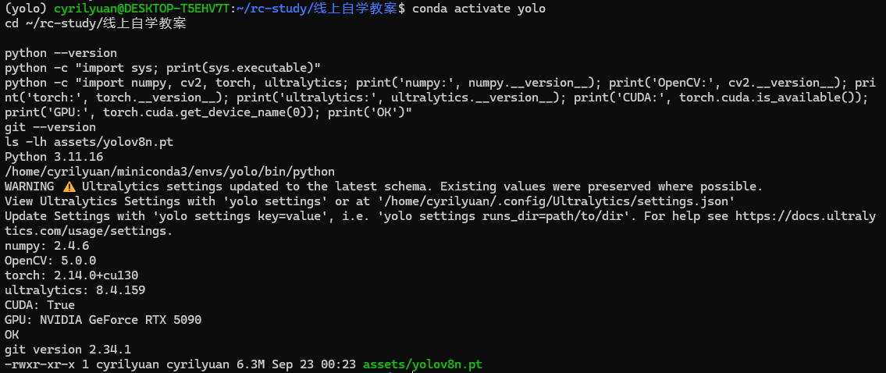
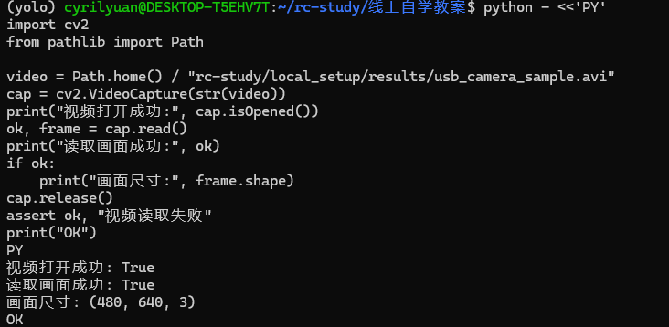

# T01 环境验收

环境路线：WSL2 + Ubuntu 22.04，使用 Conda `yolo` 环境和 NVIDIA GeForce RTX 5090。

Python 3.11.16；NumPy 2.4.6；OpenCV 5.0.0；PyTorch 2.14.0+cu130；Ultralytics 8.4.159；Git 2.34.1。

## 环境自检

- [x] Python 版本达到要求。
- [x] NumPy、OpenCV、PyTorch、Ultralytics 能导入并打印版本。
- [x] CUDA 可用，识别到 RTX 5090。
- [x] Git 命令行可用。
- [x] `assets/yolov8n.pt` 存在。
- [x] 视频能够打开并读取画面。

## 视频读取

使用 Windows USB 摄像头录制的真实测试片段，在 WSL 中用 OpenCV 打开并读取，画面尺寸为 640×480。本次验证的是视频文件读取。

